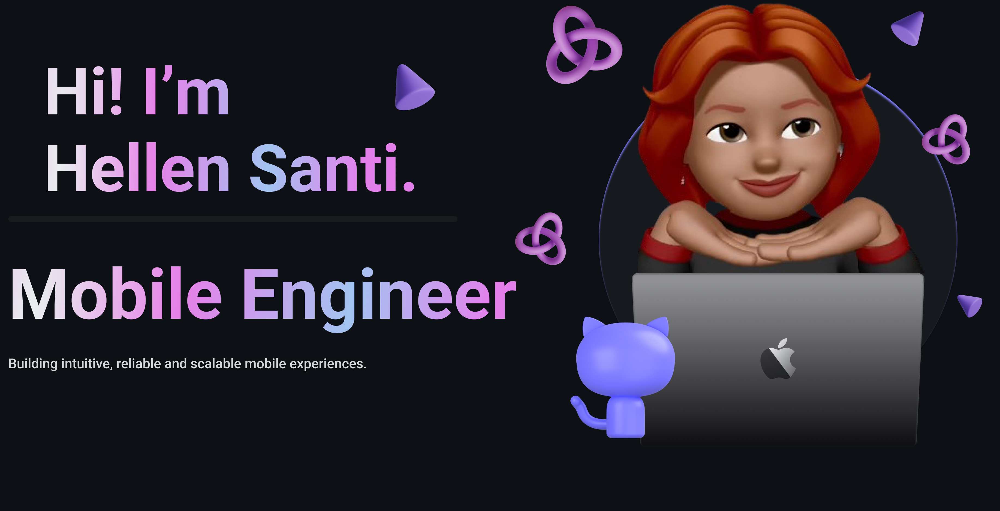

<!-- Right Side GIF -->

  

<!-- Start Intro -->

I am a Mobile Engineer focused on building intuitive, reliable and scalable mobile experiences.
I have experience with iOS development and cross-platform mobile solutions, combining performance, architecture and user-centered thinking.

- 📱 Mobile Engineer focused on iOS and scalable mobile products
- 🎓 Postgraduate degree in Artificial Intelligence
- 🚀 Currently pursuing an MBA in Software Engineering
- 🌱 Expanding my skills in Flutter, React Native, Kotlin and AI applied to mobile experiences
- 💡 Passionate about mobile architecture, performance, innovation and digital products
- 💻 Building a portfolio focused on modern mobile solutions

<!-- Profile Count Badge -->

  

<!-- Technologies and Tools Section -->
<h2 align="center">Tᴇᴄʜɴᴏʟᴏɢɪᴇs & Tᴏᴏʟs</h2>

  
  
  
  
  
  
  
  
  
  
  

 
<h3 align="left">Current Learning</h3>

<ul align="left">
  <li>Deepening my knowledge in mobile architecture and scalable app development.</li>
  <li>Expanding my skills in Flutter, React Native and Kotlin for cross-platform and Android development.</li>
  <li>Studying Software Engineering through my MBA, with focus on architecture, quality and scalable systems.</li>
  <li>Applying Artificial Intelligence concepts to mobile products and digital solutions.</li>
</ul>

<!-- Github Stats Table -->
<h2 align="center">📊 Gɪᴛʜᴜʙ Sᴛᴀᴛs 📊</h2>
  <tr>
        </a>
      

    </td>
    <td width="100%">
      <h3 align="center"><strong>Sᴛʀᴇᴀᴋ Sᴛᴀᴛs</strong></h3>
      

      
      

    </td>
  </tr>
  </tr>
</table>
 

<!-- Contribution Graph -->
<h2 align="center">📈 Cᴏɴᴛʀɪʙᴜᴛɪᴏɴ Gʀᴀᴘʜ 📈</h2>
<!-- Snake Animation -->

  <picture>
    <source media="(prefers-color-scheme: dark)" srcset="https://raw.githubusercontent.com/Heiny-H/Heiny-H/output/github-snake-dark.svg" />
    <source media="(prefers-color-scheme: light)" srcset="https://raw.githubusercontent.com/Heiny-H/Heiny-H/output/github-snake.svg" />
    
  </picture>

---

<!-- Dynamic Quote card updates everyday -->
<h2 align="center">🌟 Tʜᴏᴜɢʜᴛ ᴏғ ᴛʜᴇ Dᴀʏ 🌟</h2>

<!--STARTS_HERE_QUOTE_CARD-->

    

<!--ENDS_HERE_QUOTE_CARD-->

---
<!-- Connect With Me -->
<h2 align="center">Cᴏɴɴᴇᴄᴛ Wɪᴛʜ Mᴇ</h2>

  

